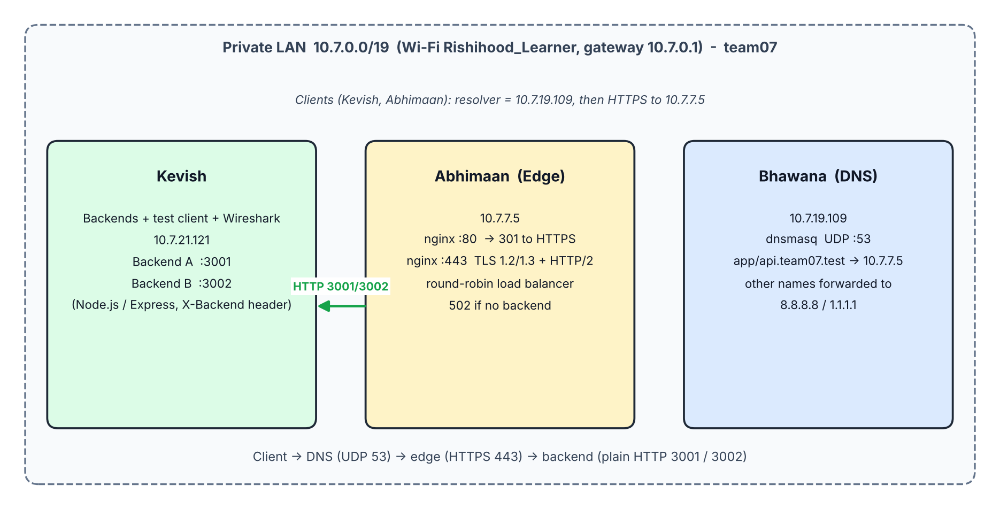
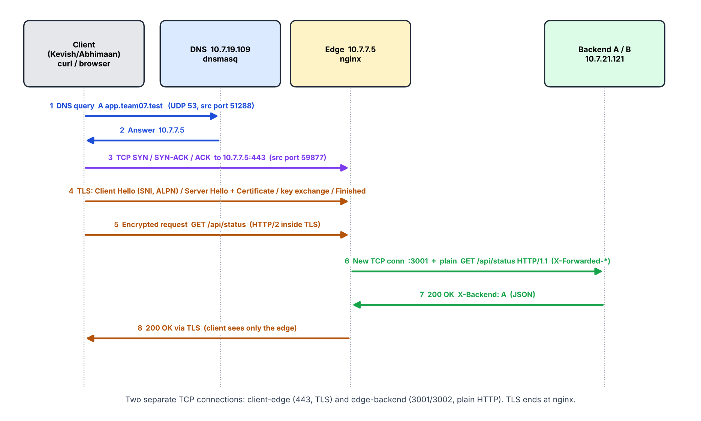

# team07 - Architecture Document (Phase 1)

Team: Kevish, Bhawana, Abhimaan. Domain: `app.team07.test`, `api.team07.test`. Network: `Rishihood_Learner`, 10.7.0.0/19, gateway 10.7.0.1.
(Three Macs instead of four: the DNS role and edge role are separate Macs; both backends run on one Mac on ports 3001/3002.)

## 1. Topology

## 2. Machine roles and IP / service table
| Owner | Role | IP | Services / ports |
|---|---|---|---|
| Bhawana | Private DNS | 10.7.19.109 | dnsmasq, UDP 53 |
| Abhimaan | Edge: TLS terminator + reverse proxy + load balancer | 10.7.7.5 | nginx TCP 80 (redirect), TCP 443 (TLS, HTTP/2) |
| Kevish | Backends + test client + Wireshark | 10.7.21.121 | Backend A TCP 3001, Backend B TCP 3002 |

DNS records (dnsmasq): `app.team07.test -> 10.7.7.5`, `api.team07.test -> 10.7.7.5`, TTL 60 s; all other names forwarded to 8.8.8.8 / 1.1.1.1.
Clients using the private DNS: Kevish and Abhimaan (Wi-Fi DNS = 10.7.19.109).

## 3. Request flow, layer by layer

| Step | Layer / protocol | Captured evidence (CN-phase-1.pcapng) |
|---|---|---|
| 1-2 | DNS over UDP 53 | frames 3-4: 10.7.21.121:51288 -> 10.7.19.109:53; answer A 10.7.7.5 |
| - | ARP / Ethernet | frames 5, 7: who-has 10.7.7.5 -> 72:94:6f:7b:aa:c9; frames go directly to the host, not the gateway |
| 3 | TCP three-way handshake | frames 6, 8, 9: 59877 -> 443 SYN, SYN-ACK, ACK |
| 4 | TLS 1.2 handshake | frames 10-17: Client Hello (SNI, ALPN), Server Hello + Certificate (issuer team07 Local Root CA), key exchange, Finished |
| 5, 8 | HTTP/2 inside TLS | frames 18-34: Application Data (encrypted) |
| 6-7 | Plain HTTP/1.1 edge -> backend | frames 23-31: 10.7.7.5:52981 -> 10.7.21.121:3001, GET /api/status with X-Forwarded-* headers |

TLS terminates at nginx. The edge opens a second TCP connection to the chosen backend; backends see the edge's IP (`from=10.7.7.5`) and the real client IP only in `X-Forwarded-For`.

## 4. OSI / TCP-IP mapping
| OSI | TCP/IP | In this project |
|---|---|---|
| 7 Application | Application | HTTP/1.1, HTTP/2, DNS, Cache-Control / ETag, X-Backend |
| 6 Presentation | Application | TLS encryption and certificates (OpenSSL CA, nginx ssl) |
| 5 Session | Application | TLS session / ALPN negotiation |
| 4 Transport | Transport | TCP 443, 3001, 3002 (handshake, Seq/Ack, Win, SACK); UDP 53 |
| 3 Network | Internet | IPv4 10.7.0.0/19, ICMP ping (ttl=64) |
| 2 Data link | Link | Wi-Fi/Ethernet frames, MAC addresses, ARP |
| 1 Physical | Link | Wi-Fi radio |

## 5. Cloud equivalents
| Our component | Cloud equivalent |
|---|---|
| dnsmasq with host-records | Amazon Route 53 private hosted zone |
| nginx TLS termination + round-robin + health checks | Application Load Balancer with ACM certificate and target-group health checks |
| Backend A / B | EC2 / ECS targets in a target group |
| Our root CA + server cert | AWS Certificate Manager / a public CA |
| `max_fails` + `fail_timeout` + `proxy_next_upstream` | ALB health checks and automatic deregistration |
| nginx 502 | ALB 502 / 503 when no healthy target |
| Wireshark on a client | VPC Flow Logs / packet mirroring |

## 6. Design decisions
- `.test` is reserved for private use (public DNS returns NXDOMAIN from the root zone); `.local` belongs to mDNS.
- Caching is done by backend `Cache-Control` + `ETag`, not nginx `proxy_cache`, so load-balancer alternation stays visible.
- Both name records point at the edge; the client never learns backend IPs.
- Single points of failure: DNS Mac and edge Mac (addressed in Phase 2).

## 7. Incidents (see evidence/A-lan and evidence/D-loadbalancer)
1. `No route to host` toward Kevish (ARP failure), fixed by a Wi-Fi reconnect.
2. nginx refused on :80: a leftover nginx from the previous project held 8080/443 and its config did not include `servers/*`; fixed with a clean `nginx.conf` and a root-owned brew service.
